# Worlds most EVIL keyword

---

# Pieter Joost van de Sande

---

# Software Architect

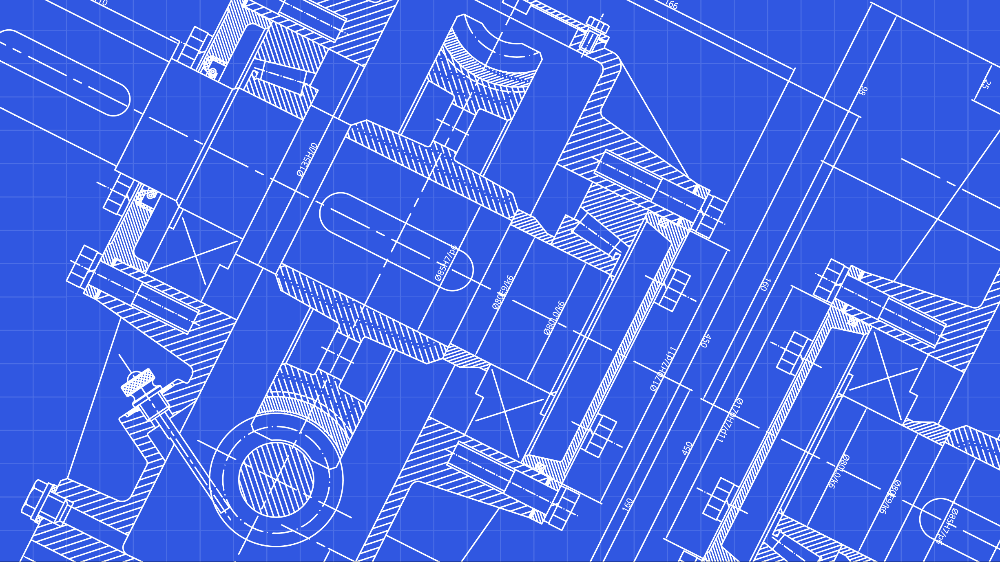

---


[.background-color: #FFFFFF]

^ wercker
* continues integration and delivery platform
* serving 100k builds per day
* world wide customer base
* sold to Oracle

---


^ doubledutch
* eventing platform software
* 10.000 of people simultaneously try to slam the API
* we serve millions of customers a year
* There’s our data pipeline that processes billions of data points. We capture taps, swipes, and scrolls and report on them in real time.

---


[.background-color: #FFFFFF]
 
^ microsoft
* CQRS Journey advisory board

---


[.background-color: #FFFFFF]

^ apple
* FoundationDB Go bindings
* distributed acid complianed database that is internet scale

---


[.background-color: #FF9F00]

^ HappyPancake
* largest dating site in Sweden, Norway and Finland
* average session 18 minutes

---

# 155 day streak record


[.background-color: #FFFFFF]

---


---

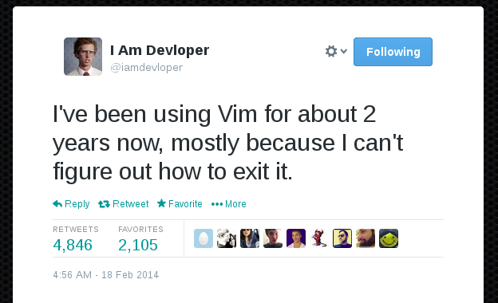

[.background-color: #000000]

---

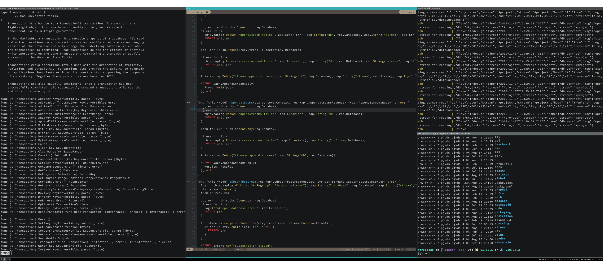

[.background-color: #000000]

---

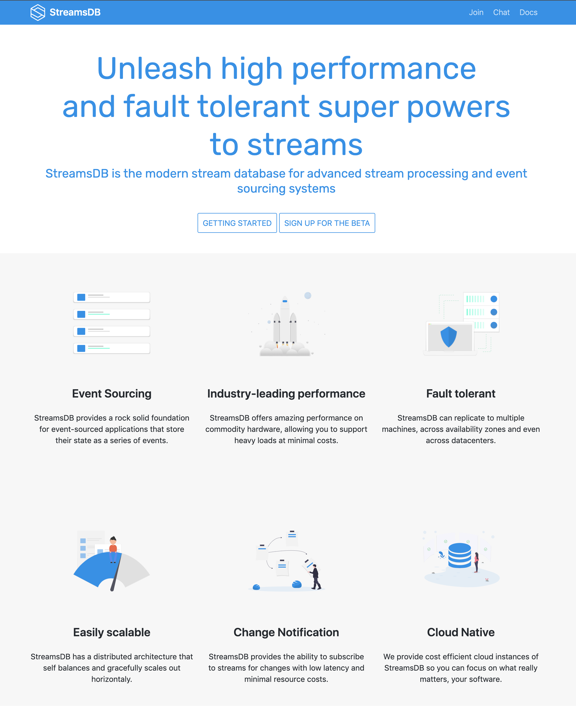

---

# I :heart: messaging AND distribution

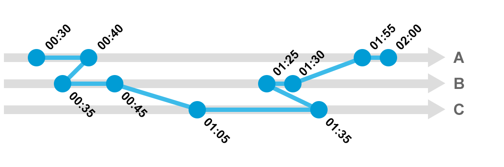


[.text: #000000 ]
[.background-color: #FFFFFF]

---


[.background-color: #000000]

^
* What will we talk about?
* Messaging, scalability, domain driven design, micro services

---

# Let's talk about EVIL


---

# [fit] What's the most evil
# [fit] keyword you know?

---

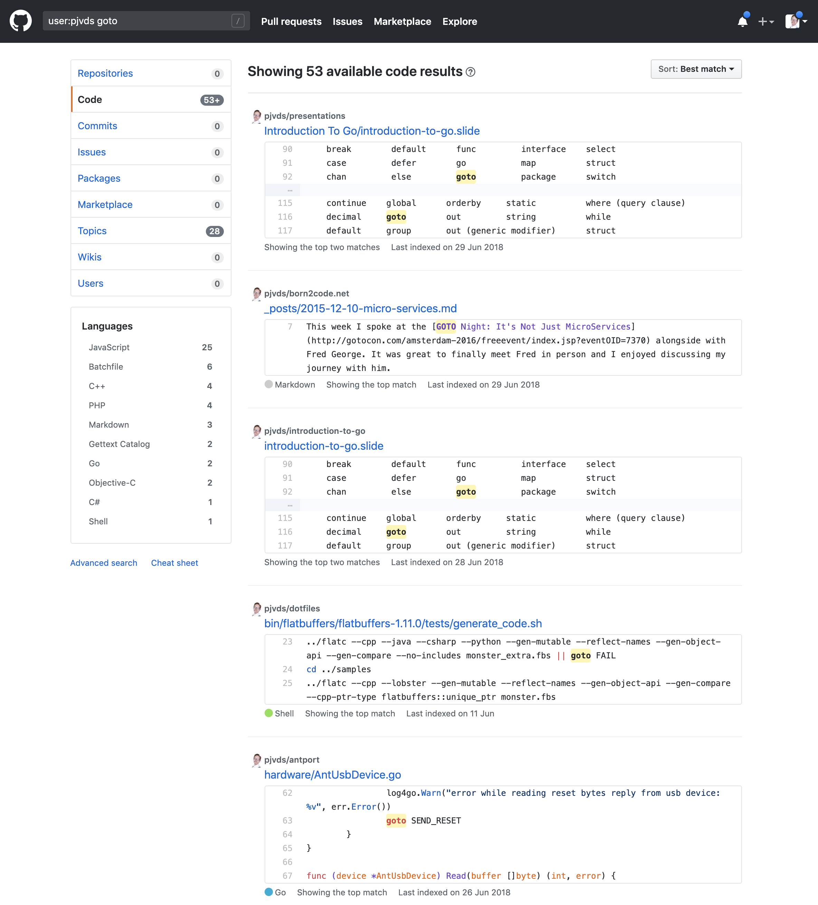

___

# IF is EVIL


---

# Two-face


---

# the protector


---

```go
// name is required
if len(name) == 0 {
  return errors.New("name is required")
}

// make sure there is a product
if product == nil {
  return errors.New("product cannot be nil")
}

// never go out of bound
if cursor > limit {
  return errors.New("cursor out of bound")
}

// make sure is valid json
if ok, err := deserialize(input); !ok {
  return errors.Wrap(err, "deserialization failed")
}
```

^ 
* protects our code for all the evil from the outside world
* make sure something is not null
* index is not out of bound
* good old defensive programming

---

# the deceiver


^ 
* IF here is not technocratic, but business oriented

---


A monolithic design is characterised by such a tight coupling among modules that they have no independent existence.

---


[.background-color: #FFFFFF]

---

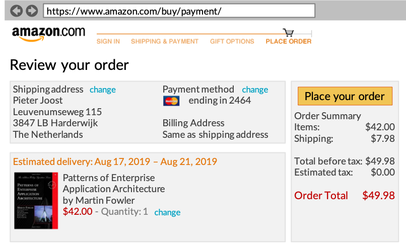

# checkout policy

the product must be in *stock*

it must be allowed to *ship* to country

the *payment* must be accepted

*product* must not be deleted

the *price* should not have changed

^ TODO: are the business rules still in line with the story?

---

# how would we satisfy the requirements?

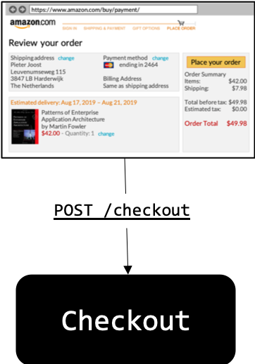

[.background-color: #FFFFFF]

^ TODO: break down in steps

---

```golang
func Checkout(r CheckoutRequest) {
  // make sure we have stock
  if inventory.GetStock(r.ProductId) < r.Quantity {
    return errors.New("insufficient stock")
  }

  // make sure it is not deleted
  if product.Status(r.ProductId) == Deleted {
    return errors.New("product unavailable")
  }

  // check the price
  if pricing.GetPrice(r.ProductId) != r.Price {
    return errors.New("product price changed")
  }

  // payment must be accepted
  if payment.GetStatus(r.OrderId) != Accepted {
    return errors.New("payment not accepted")
  }

  // remove quantity from inventory
  inventory.DecreaseStock(r.ProductId, r,Quantity)

  // ship it!
  shipment.MarkReady(r.OrderId);
}
```

^ here the if statement is not technocratic, but a business rule

---

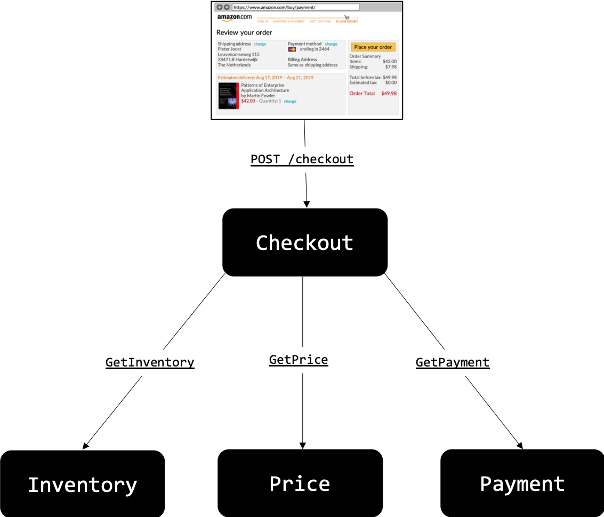

[.background-color: #FFFFFF]

---

# How do we guarantee consistency?

| ID | Name      | Quantity | Price  |
|----|-----------|----------|--------|
| 1  | Product A | 13       | € 42,- |
| 2  | Product B | 1        | € 3,14 |

---

```pgsql
begin transaction
  var stock = SELECT stock FROM Products
              WHERE Id = @ProductID;

  IF(stock <= @Quantity)
    THROW 51000, 'insufficient stock';  

  var payed = SELECT isPayed FROM Order
              WHERE Id = @PaymentID;

  IF(payed)
    THROW 52000, 'order not payed';
  IF(kk)

  UPDATE Products SET Stock = stock-@Quantity;

  UPDATE Order SET readyToShip = true;
end transaction
```

^ // serializable isolation level

---

# How to *scale*?


^
* scale with bigger hardware
* horizontal scaling
* forklift upgrade
* won't work with document databases

---

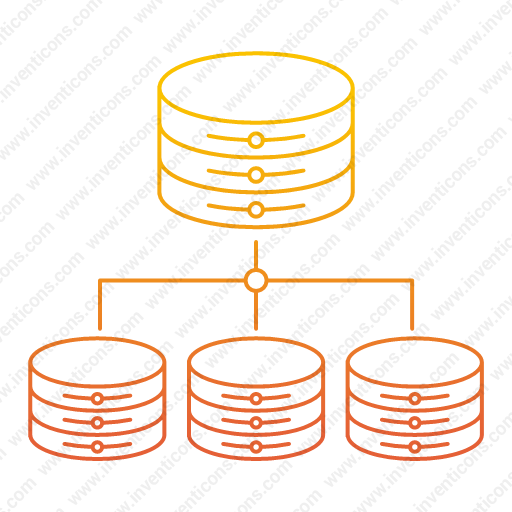

^
* we can introduce more nodes
* data will be replicated
* but won't be able to have ACID properties anymore

---

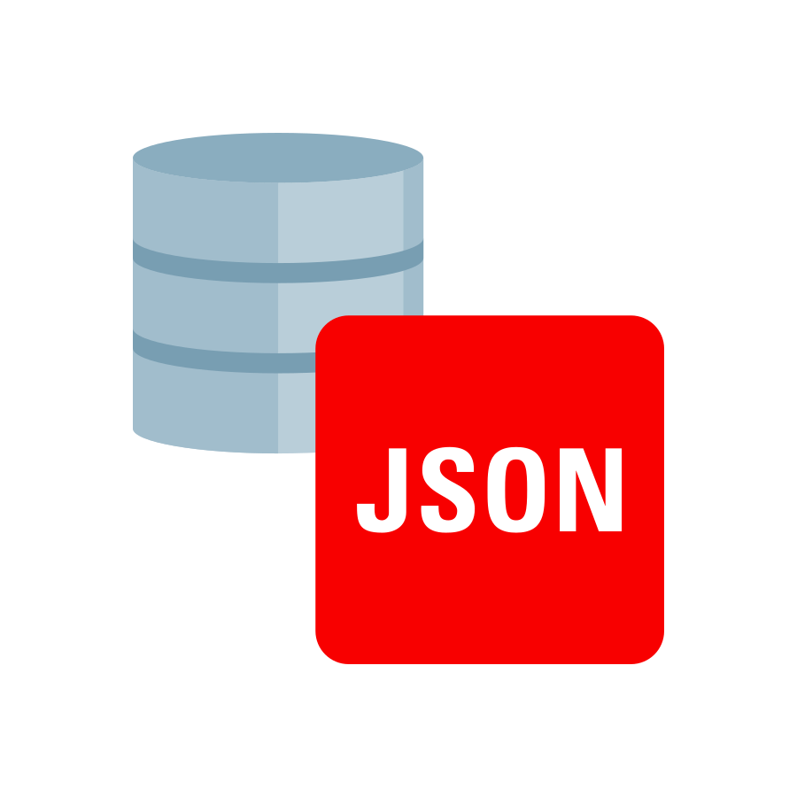

^ trully internet scale, but lack of transactions

---


# coupling

^ coupling is the degree to which each module relies on each one of the other modules.

---

# Split it!


---

# Micro Services

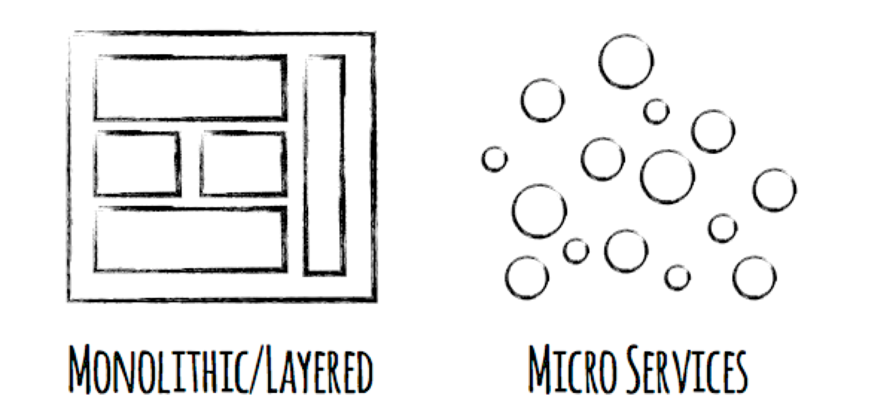

[.background-color: #FFFFFF]

---

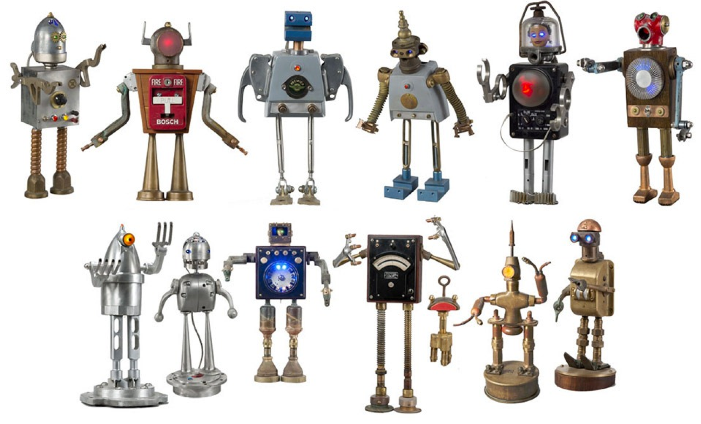

^ the most important property of an micro service

[.background-color: #FFFFFF]

---

> “No μService should ever depend on another being available"

---

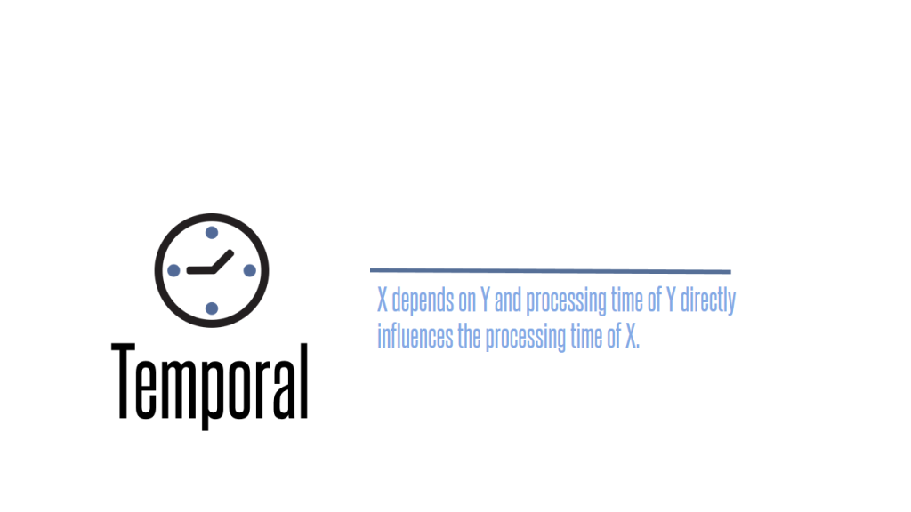

[.background-color: #FFFFFF]

---


[.background-color: #FFFFFF]

---

# How do you depend on your partner?


---


[.background-color: #000000]

---


[.background-color: #FFFFFF]

---

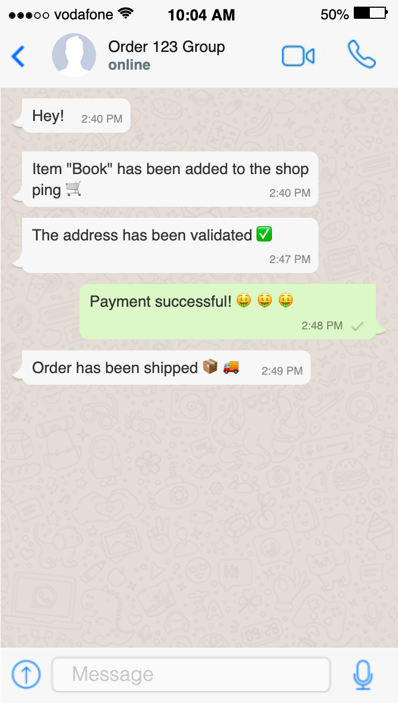

---

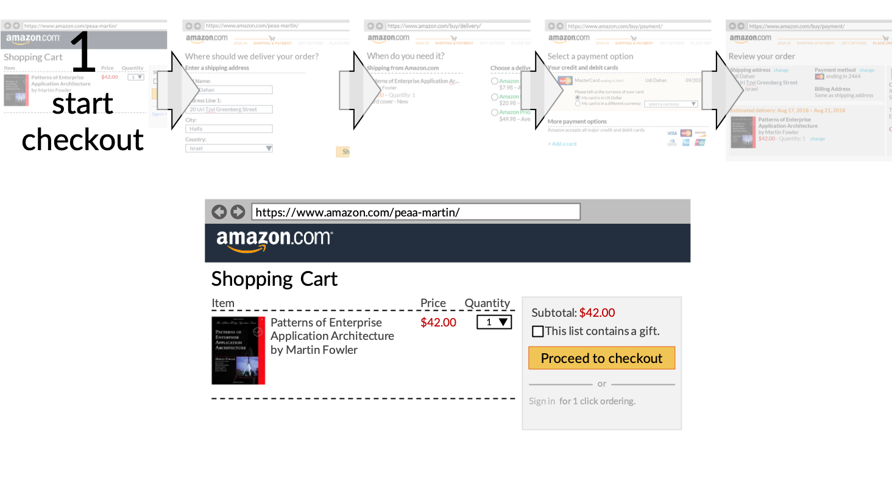

---

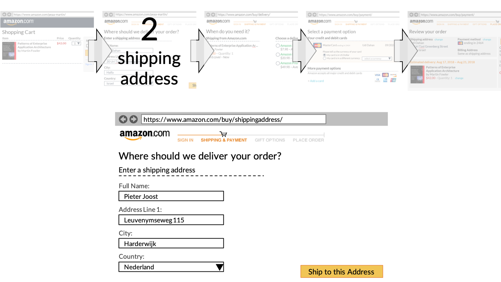

---

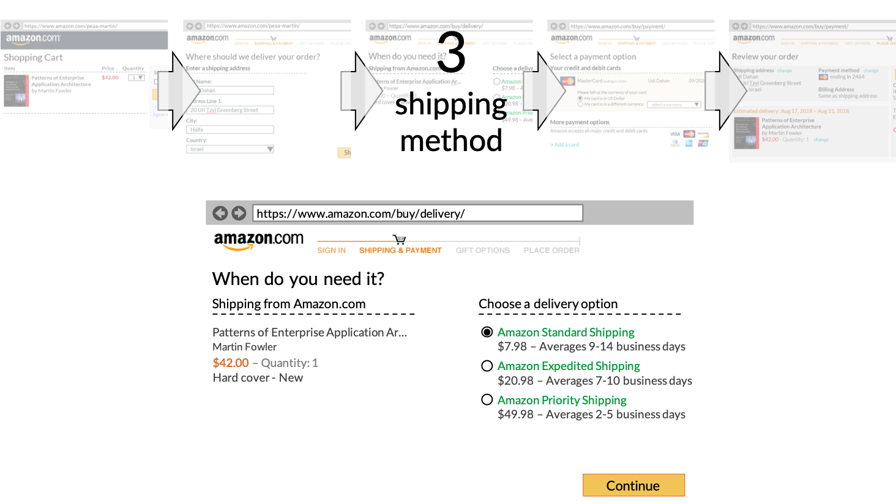

---

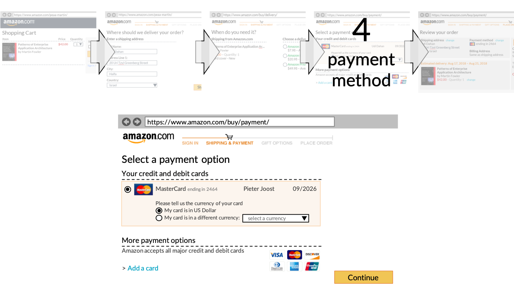

---

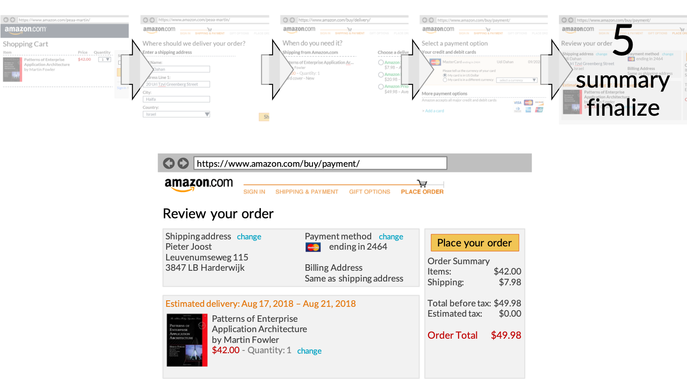

---

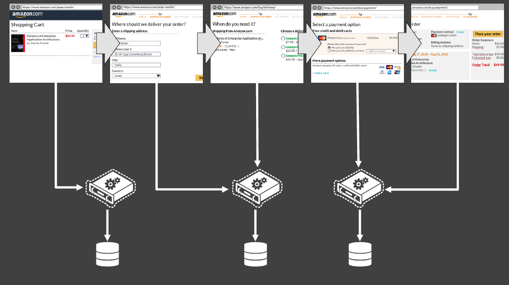

^
* what happens when during checkout the price changes?

---

# Add Product to Shopping cart

```js
{
  orderID: 1,
  productID: 2,
  quantity: 1,
  price: {
    amount: 7.98,    // <-- save price in message
    currency: "USD", 
  }
}
```

---

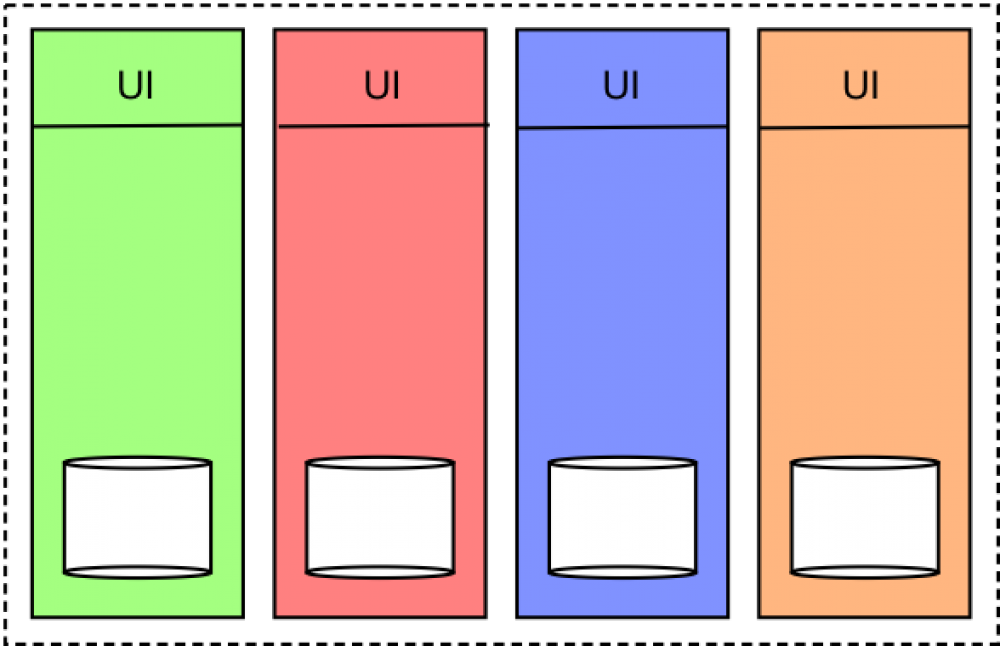

---


[.background-color: #FFFFFF]

---

# compensating actions


[.background-color: #FFFFFF]

---

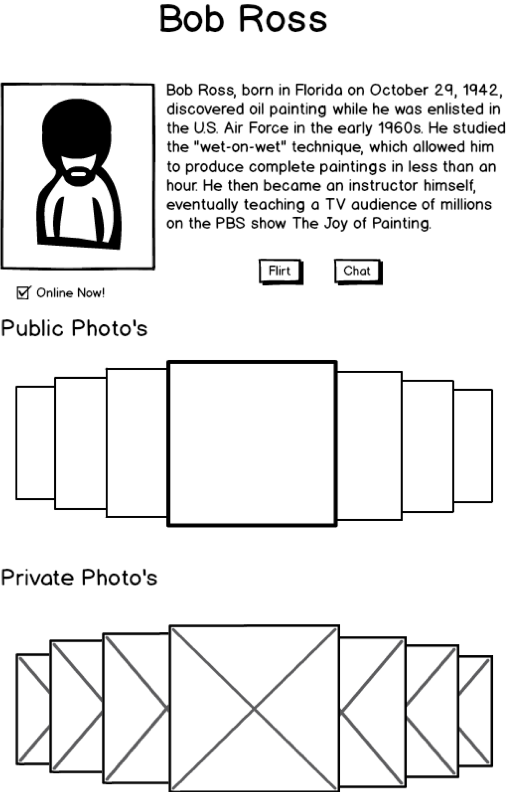
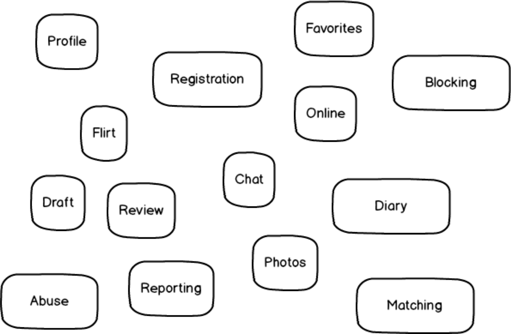

[.background-color: #FFFFFF]

---

> No μService represents an *business* entity, but rather serves an *expectation* of one

---

# You've been a great audience!

Questions?

WhatsApp: +31 6 54 22 44 89
Mail: pj@craftify.nl
Twitter: @pjvds
